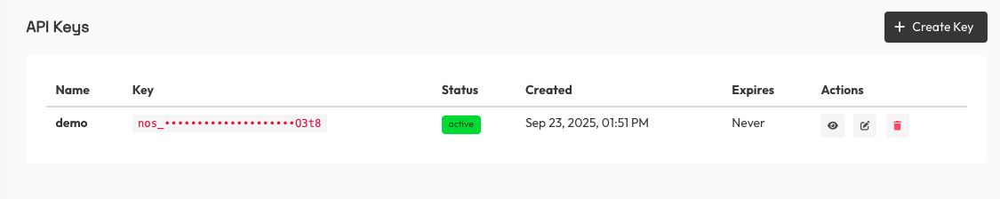
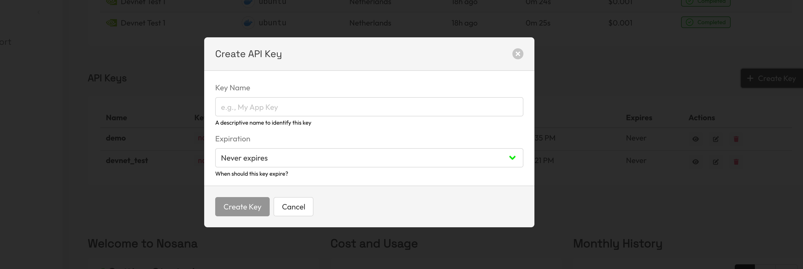

# Create Deployments with Nosana API

Call Nosana's REST API directly using your API key for deployment management and credit operations.

[API reference](https://dashboard.k8s.prd.nos.ci/api/swagger).

## Get an API Key

You can create an API key from the Nosana dashboard.

1. Log in at `https://dashboard.nosana.com`
2. Go to `Account`
3. Find the `API Keys` section
4. Click `Create Key`





## API Examples

### Create a deployment using credits

```sh
export NOSANA_API_KEY="nos_xxx_your_api_key"

curl -X POST "https://dashboard.k8s.prd.nos.ci/api/deployments/create" \
  -H "Content-Type: application/json" \
  -H "Authorization: Bearer $NOSANA_API_KEY" \
  -d '{
    "name": "Hello World",
    "market": "7AtiXMSH6R1jjBxrcYjehCkkSF7zvYWte63gwEDBcGHq",
    "timeout": 60,
    "replicas": 1,
    "strategy": "SIMPLE",
    "job_definition": {
      "version": "0.1",
      "type": "container",
      "meta": {
        "trigger": "cli"
      },
      "ops": [
        {
          "type": "container/run",
          "id": "hello-world",
          "args": {
            "cmd": ["echo hello world"],
            "image": "ubuntu"
          }
        }
      ]
    }
  }'
```
You can find the available markets/GPUs in the [Nosana dashboard](https://dashboard.nosana.com/markets)

### Start a deployment
After creating the deployment, you will need to start it.

```sh
curl -s \
  -H "Authorization: Bearer $NOSANA_API_KEY" \
  https://dashboard.k8s.prd.nos.ci/api/deployments/<deployment_id>/start | jq .
```

### Retrieve deployments

List all deployments:

```sh
curl -s \
  -H "Authorization: Bearer $NOSANA_API_KEY" \
  https://dashboard.k8s.prd.nos.ci/api/deployments | jq .
```

Get a specific deployment:

```sh
curl -s \
  -H "Authorization: Bearer $NOSANA_API_KEY" \
  https://dashboard.k8s.prd.nos.ci/api/deployments/YOUR_DEPLOYMENT_ID | jq .
```

For all available deployment endpoints see the [API reference](https://dashboard.k8s.prd.nos.ci/api/swagger).

### Check credit balance

```sh
curl -s \
  -H "Authorization: Bearer $NOSANA_API_KEY" \
  https://dashboard.k8s.prd.nos.ci/api/credits/balance | jq .
```

Response:
```json
{
  "assignedCredits": 100.0,
  "reservedCredits": 10.0,
  "settledCredits": 5.0
}
```

**Note:** Available balance = assignedCredits - reservedCredits - settledCredits

