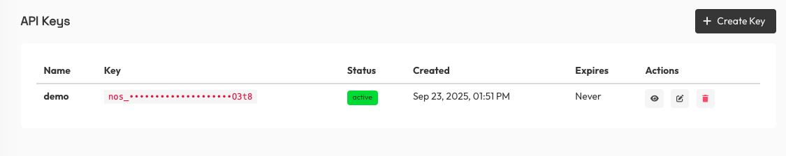

# Create Deployments using Credits

Use your API key to create and manage deployments using Nosana credits. Key SDK methods:

- `client.api.credits.balance()` — check your available credits
- `client.deployments.create()` — create a deployment
- `client.deployments.get(id)` / `client.deployments.list()` — retrieve deployment(s)
- Deployment instance methods: `start()`, `stop()`, `archive()`, `getTasks()`, etc.

For the full set of deployment SDK methods, see the [Deployments SDK docs](https://github.com/nosana-ci/nosana-sdk/tree/main/src/services/deployments).

## Prerequisites

- Install [the SDK](https://www.npmjs.com/package/@nosana/sdk)

```sh:no-line-numbers
npm install @nosana/sdk
```

## Get an API Key

You can create an API key from the Nosana dashboard.

1. Log in at `https://dashboard.nosana.com`
2. Go to `Account`
3. Find the `API Keys` section
4. Click `Create Key`




## Initialize the client with API key

```ts
import { Client } from '@nosana/sdk';

const API_KEY = 'nos_xxx_your_api_key';

const client = new Client('mainnet', undefined, {
  apiKey: API_KEY,
});
```

## Check credit balance

```ts
const balance = await client.api.credits.balance();
const available = balance.assignedCredits - balance.reservedCredits - balance.settledCredits;
console.log(`Balance available: $${available.toFixed(2)}`);
```

## Create a deployment using credits

```ts
// Available markets can be found on the explorer
const market = '7AtiXMSH6R1jjBxrcYjehCkkSF7zvYWte63gwEDBcGHq';

const deployment = await client.deployments.create({
  name: 'Hello World',
  market,
  timeout: 60, // 60 minutes
  replicas: 1,
  strategy: 'SIMPLE',
  job_definition: {
    "version": "0.1",
    "type": "container",
    "meta": {
      "trigger": "cli"
    },
    "ops": [
      {
        "type": "container/run",
        "id": "hello-world",
        "args": {
          "cmd": "for i in `seq 1 30`; do echo $i; sleep 1; done",
          "image": "ubuntu"
        }
      }
    ]
  };
});

console.log('Created deployment:', deployment.id);
```
You can find the available markets/GPUs in the [Nosana dashboard](https://dashboard.nosana.com/markets)

## Start a deployment

```ts
const deployment = await client.deployments.get(deployment.id);
await deployment.start();
```

## Retrieve deployments

List all deployments:

```ts
const deployments = await client.deployments.list();
```

Get a specific deployment:

```ts
const deployment = await client.deployments.get('YOUR_DEPLOYMENT_ID');
```

For more information on the full SDK deployments API, see the [SDK Deployments README](https://github.com/nosana-ci/nosana-sdk/blob/main/src/services/deployments/README.md).
