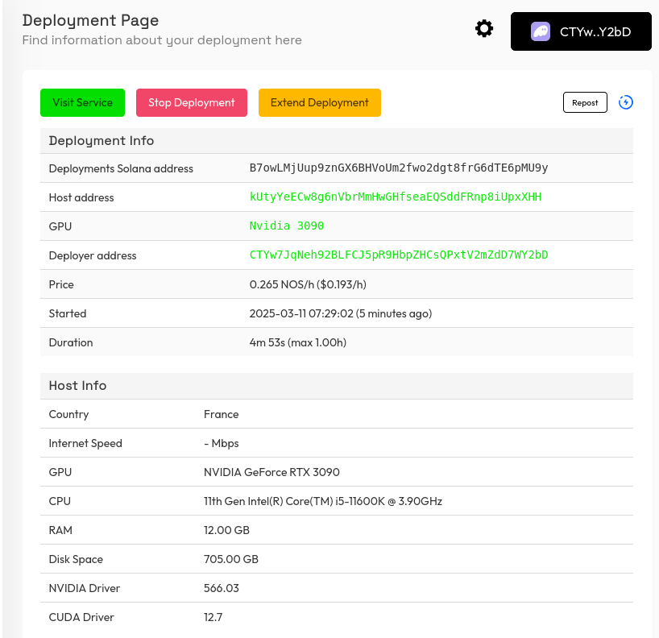

# DeepSeek R1

<iframe
  width="560"
  height="315"
  src="https://www.youtube.com/embed/4c31VE60bII"
  title="Nosana: DeepSeek-R1"
  frameborder="0"
  allow="accelerometer; autoplay; clipboard-write; encrypted-media; gyroscope; picture-in-picture; web-share"
  referrerpolicy="strict-origin-when-cross-origin"
  allowfullscreen>
</iframe>

## Introduction

This tutorial should help those that are curious on how to get started using [Nosana](https://nosana.com) by deploying a [Deepseek-R1-Qwen-1-1.5B](https://huggingface.co/deepseek-ai/DeepSeek-R1-Distill-Qwen-1.5B) model.

A high-throughput and memory-efficient inference engine for running DeepSeek R1-Qwen-1.5B model using vLLM. This template provides an OpenAI-compatible API server for the R1-Qwen-1.5B model, optimized for performance using vLLM. This model is based on Qwen2.5-Math-1.5B and fine-tuned with DeepSeek-R1 samples, offering efficient performance for lightweight deployments.

The advantage of using Nosana with DeepSeek R1 is that it simplifies the deployment process, allowing you to focus on model development and optimization.

## Pre-requisites

### Required

- [Node.JS](https://nodejs.org/en/download/)
- [`@nosana/cli`](https://github.com/nosana-ci/nosana-cli)

### Optional

- [curl (Optional)](https://curl.se/)
- [Python (Optional)](https://www.python.org/downloads/)
- [OpenAI-Node (Optional)](https://github.com/openai/openai-node?tab=readme-ov-file)
- [OpenAI-Python (Optional)](https://github.com/openai/openai-python)

## Quick Start

Can't wait to get started? Here's a quick guide to deploying the DeepSeek R1 model using the Nosana CLI.

### Using the Nosana Dashboard

For complete beginners, the easiest way to deploy the DeepSeek R1 model is through the Nosana Dashboard. The Dashboard provides a user-friendly interface that will guide you through the deployment process step by step.

**Deploy this model now with [Nosana Dashboard](https://dashboard.nosana.com/jobs/create?templateId=deepseek-r1-qwen-1.5b)**

### Using Nosana CLI

Assuming you have the [Nosana CLI](https://github.com/nosana-ci/nosana-cli) installed and you have topped up your wallet with [SOL](https://solana.com/) and [NOS](https://nosana.com/token).

### Setting up Nosana CLI

To get your wallet address, and top up your wallet:

```bash
npx @nosana/cli address
```

### Deploying via CLI

Deploy the DeepSeek R1 model using the following command:

```bash
npx @nosana/cli job post \
  --url https://template.nosana.com/Deepseek-R1-Qwen-1.5B/job-definition.json \
  --market nvidia-4090 \
  --timeout 60 \
  --wait \
  --verbose
```

This will deploy the DeepSeek R1 model on the Nosana network using the specified job definition file. You will see some output indicating the status of the deployment process, and once the job is successfully deployed, you can start using the model right away.

:::info
The model will be available for use at the Service URL provided in the output. Which has the following format:
`https://<nosana-job-id>.node.k8s.prd.nos.ci`
:::

### Interacting with the Model

Now you can interact with the deployed model using the provided Service URL. Use curl, Postman, or any other HTTP client to send requests to the model and receive responses.

::: info
Please note that the following examples need to be adjusted to match the actual job ID. Remember to change the `<nosana-job-id>` with the actual job ID.
:::

#### [curl](https://curl.se/)

::: details
Using curl, we can easily get a response back. Copy and paste this in your terminal.

<AsciinemaCast
  src="/cast/curl.cast"
/>

```bash
curl https://<nosana-job-id>.node.k8s.prd.nos.ci/v1/chat/completions \
  -H "Content-Type: application/json" \
  -d '{
     "model": "R1-Qwen-1.5B",
     "messages": [{"role": "user", "content": "Tell me something about Nosana."}],
     "temperature": 0.7
   }'
```
:::

#### [OpenAI Python Client](https://github.com/openai/openai-python)

::: details
You can use the OpenAI Python Client to connect to the endpoint and get started building.


<AsciinemaCast
  src="/cast/openai_python.cast"
/>

First install the OpenAI Python Client.

```bash
pip install openai
```

Then you can use the following Python code to interact with the model.

@[code python](./openai.py)
:::

#### [OpenAI Node.JS Client](https://github.com/openai/openai-node)

::: details

<AsciinemaCast
  src="/cast/openai_js.cast"
/>

You can also use the OpenAI Node.js Client to connect to the endpoint and get started building.

First install the OpenAI Node.js Client.

```bash
npm i -g openai
```

Then you can use the following TypeScript code to interact with the model.

@[code ts](./openai.ts)
:::

#### [Open WebUI](https://github.com/open-webui/open-webui)

::: details
Using the Open WebUI, you can interact with the model using a user-friendly interface.
Remember to change the `<nosana-job-id>` with the actual job ID.


Start the WebUI locally.

```sh
docker run -d \
  -p 8080:8080 \
  -e OPENAI_API_BASE_URL=https://<nosana-job-id>.node.k8s.prd.nos.ci/v1 \
  -v open-webui:/app/backend/data \
  --restart always \
  ghcr.io/open-webui/open-webui:main
```

The service will be available at [http://localhost:8080](http://localhost:8080).

Use the [Starting with Ollama Guide](https://docs.openwebui.com/getting-started/quick-start/starting-with-ollama/) to add your Nosana Service URL DeepSeek endpoint to the Open WebUI.

:::

### Troubleshooting Common Issues

**Deployment Fails:**
- Ensure sufficient NOS/SOL tokens in your wallet, you will need a minimum of 0.05 SOL, and a minimum amount of NOS to pay for the Nosana deployment. On the [NVIDIA-3090 Market](https://dashboard.nosana.com/markets/CA5pMpqkYFKtme7K31pNB1s62X2SdhEv1nN9RdxKCpuQ) it costs **$0.192/hour**. Make sure you have that amount in NOS.
- Verify network connectivity.

**API not responding:**
- Check Service URL is correct (verify `<nosana-job-id>`).

**CLI authentication issues:**
- Confirm correct private key imported into Nosana Dashboard.

If issues persist, contact Nosana support on [Discord](https://discord.gg/nosana).

## Setup and Preparation

As mentioned in the prerequisites, you need to have the necessary software installed on your system.

## Nosana Job Specification

This is a standard Nosana Job Specification. With this you can define how a Nosana job will operate.
The most important parameters of the job specification are:

- `image`: The Docker image to use for the job.
- `entrypoint`: The entrypoint for the container, this is the first shell command to run.
- `cmd`: The command to run inside the container, this can be used to specify any parameters such as flags.
- `gpu`: Whether the job requires a GPU.
- `expose`: The port to expose for the service.

@[code json](./deepseek.json)

To read more about the Job Specification, go to [Nosana Job Specification Section](../../inference/job_schema.md).

<!-- ## Containerization -->
<!---->
<!-- To build your own Docker container, create a `Dockerfile`, which contains instructions on how to the image will be built, and what extra requirements will be needed. -->
<!---->
<!-- @[code docker](./Dockerfile) -->
<!---->
<!-- Here we are using the `vllm/vllm-openai` base image. Then we install [Open WebUI](https://github.com/open-webui/open-webui), a user friendly AI interface. Then we download the `DeepSeek-R1-Distill-Qwen-1.5B` model and run it via [vLLM](https://github.com/vllm-project/vllm), a high-throughput and memory-efficient inference and serving engine for LLMs. The provided Docker image (`vllm/vllm-openai`) comes optimized for high-throughput inference with minimal overhead, making it ideal for serving models efficiently. Additionally, integrating Open WebUI enhances user interaction capabilities for immediate testing and usage. -->
<!---->
<!-- ### Build the Container -->
<!---->
<!-- The next step is to build the container, we do this by running: -->
<!---->
<!-- ```bash -->
<!-- docker build -t <hub-user>/<repo-name>:<tag> . -->
<!-- ``` -->
<!---->
<!-- Make sure you have a [Dockerhub account](https://hub.docker.com/), and use your username in `<hub-user>`. For the `<repo-name>` use anything you'd like. The `<tag>` is optional. -->
<!---->
<!-- ### Publish the Docker container -->
<!---->
<!-- Next we need to upload the Docker container to the Dockerhub Registry. Do this by running: -->
<!---->
<!-- ```bash -->
<!-- docker push <hub-user>/<repo-name>:<tag> -->
<!-- ``` -->
<!---->
<!-- Now you should be able to navigate to [`https://hub.docker.com/r/<hub-user><repo-name>`](https://hub.docker.com). -->
<!---->
<!-- Now we can move on to deploying our application to Nosana. -->

## Deployments

Nosana is powered by the [Solana](https://solana.com/) blockchain. All deployments on Nosana are paid by the [NOS Token](https://nosana.com/token/). **To be explicit; This means you will need to load your wallet with both NOS and SOL to pay for the deployments.** SOL is used to pay for the blockchain transactions, and NOS is used to pay for the deployments.

Follow this link to learn where to purchase NOS Tokens: [NOS token page](https://nosana.com/token/). Of course [NOS](https://nosana.com/token/) can be purchased via swaps from any Solana wallet.

- [Swapping on Phantom](https://help.phantom.com/hc/en-us/articles/6048249796243-Phantom-Swapper-FAQ)
- [Swapping on Solflare](https://academy.solflare.com/guides/how-to-swap-tokens/)

::: warning NOS Token Address
Please take note the official token address: [nosXBVoaCTtYdLvKY6Csb4AC8JCdQKKAaWYtx2ZMoo7](https://explorer.solana.com/address/nosXBVoaCTtYdLvKY6Csb4AC8JCdQKKAaWYtx2ZMoo7)
:::

### Posting Deployments

Posting deployments job to Nosana is easy. For a simplified version of creating a Nosana Deployment, use the [Deploy a Model tool](https://dashboard.nosana.com/jobs/create?templateId=qwen1.5b&randKey=8oy9rhrixrv) on the [Nosana Dashboard](https://dashboard.nosana.com/).


To deploy the Nosana [ Deepseek-R1-Qwen-1.5B ](https://huggingface.co/deepseek-ai/DeepSeek-R1-Distill-Qwen-1.5B) job using the [`@nosana/cli`], you will need to run the following command (assuming you have [Node.js](https://nodejs.org/en) installed).:

```bash
npx @nosana/cli job post \
  --url https://template.nosana.com/Deepseek-R1-Qwen-1.5B/job-definition.json \
  --market nvidia-3090 \
  --timeout 60
```
Note the use of `--url`, this is not required, you can also pass in a job definition file using the `--file` flag. On the other hand, the `--market` and `--timeout` flags, are **required**. The `--timeout` flag takes the amount of minutes as input, and specifies how long the deployment will be available.


### Nosana Market

A Nosana market is the name for a grouping of GPUs. All of the GPUs types on Nosana are organized by a Solana address or their shortname: `market-slug`.

For a full list of available markets, please take a look at [https://dashboard.nosana.com/markets](https://dashboard.nosana.com/markets/). Or run the following command:

```bash
npx @nosana/cli market list
```

To retrieve detailed details of a specific market run the following command:
`<market>` can either be, the Nosana market address (The Solana address of the market), or the market slug, `nvidia-3090` in this example.

```bash
npx @nosana/cli market get <market>
```
### Example

Here is an example of deploying the Deepseek-R1-Qwen-1.B model to Nosana in action.

<AsciinemaCast
  src="/cast/nos_job_post.cast"
/>

## Monitoring Deployments

The next step of course is to monitor how the deployment is going. To check to see what the status of the deployment is, to extend the deployment or to stop the deployment.
There are two ways to do this.

### Dashboard

The first is to use the [Nosana Dashboard](https://dashboard.nosana.com), which is the most convenient. It provides an easy to use interface to manage your deployments. You can navigate to [https://dashboard.nosana.com/](https://dashboard.nosana.com/), connect your wallet, and you should be able to see your deployments from the My Account page. You can also navigate to [https://dashboard.nosana.com/jobs/\<nosana-job-id\>](https://dashboard.nosana.com/jobs/) to see more detailed information about your deployment, stop, extend, or repost your deployment.



#### Import `@nosana/cli` privatekey

To see the deployments you are making from the [`@nosana/cli`](https://github.com/nosana-ci/nosana-cli/) tool in the Nosana Dashboard, you will need to import your privatekey into your Solana browser wallet. The Nosana privatekey can be found at `$HOME/.nosana/nosana_key.json`. The contents of this file can be imported into Phantom and Solflare, follow these guides for more information:
- [Phantom](https://help.phantom.com/hc/en-us/articles/15079894392851-Importing-an-Existing-Wallet-into-Phantom)
- [Solflare](https://academy.solflare.com/guides/how-to-import-your-solana-wallet-into-solflare-using-a-private-key/)

### CLI

Of course the [`@nosana/cli`](https://github.com/nosana-ci/nosana-cli) tool can also be used to monitor your deployment.

Run the following command to get more information about your deployment:

```bash
npx @nosana/cli job get <nosana-job-id> --wait
```

Note the use of `--wait` flag. With the `--wait` flag, you can introspect the deployment logs.

<AsciinemaCast
  src="/cast/monitor_job.cast"
/>

## Managing Deployments

Now that we know how to monitor the deployment the next step is to manage the deployment. This includes either stopping or extending the deployment. The rest of the guide will focus on using the [`@nosana/cli`](https://github.com/nosana-ci/nosana-cli/) tool.

### Stopping Deployment

When you run your job, you will have received a `<nosana-job-id>`, with this id we can stop the job. Run the following command to stop the deployment.

```bash
npx @nosana/cli job stop <nosana-job-id> 
```

<AsciinemaCast
  src="/cast/stop_job.cast"
/>

### Extending Deployment

<!-- TODO: Fix this AsciinemaCast -->
Sometimes, there will be a situation, where the reserved time you posted with the job will not be enough. In these cases you can extend the deployment by running the following command:

```bash
npx @nosana/cli job <nosana-job-id> --timeout <time-in-minutes>
npx @nosana/cli job extend FATtTRGnveSmaRZHpLissUMqWKAG1kMX8VYHQjg5Afqc --timeout 60
```

<AsciinemaCast
  src="/cast/stop_job.cast"
/>

## Wrap Up

Now that you know the basics of how Nosana Deployments, you can refer back to the [Interacting with the Model](#interacting-with-the-model) to read again how to query the model.

### Conclusion

Deploying the DeepSeek-R1-Qwen-1.5B model with Nosana significantly streamlines the process of setting up high-performance AI inference services. By leveraging Nosana’s GPU infrastructure, developers can efficiently scale deployments while maintaining optimal performance and resource utilization. Whether using the user-friendly Nosana Dashboard or the powerful Nosana CLI, the integration simplifies complex tasks, allowing teams to focus more on model innovation and less on infrastructure management. Explore Nosana's intuitive tools today to accelerate your development workflows and seamlessly bring your AI projects to life.

Now that you are familiar with deploying DeepSeek R1 on Nosana, you're ready to innovate quickly and efficiently. Visit the [ Nosana Dashboard ](https://dashboard.nosana.com) or explore more advanced CLI options to power your next AI project effortlessly.

### Next Steps

- [Explore deploying other models on Nosana.](https://dashboard.nosana.com/jobs/templates)
- [Dive deeper into Nosana's documentation for advanced job customization.](https://docs.nosana.com)
- [Join Nosana's community on Discord for support and feedback.](https://nosana.com/discord)
- [Follow Nosana on X](https://nosana.com/x)
