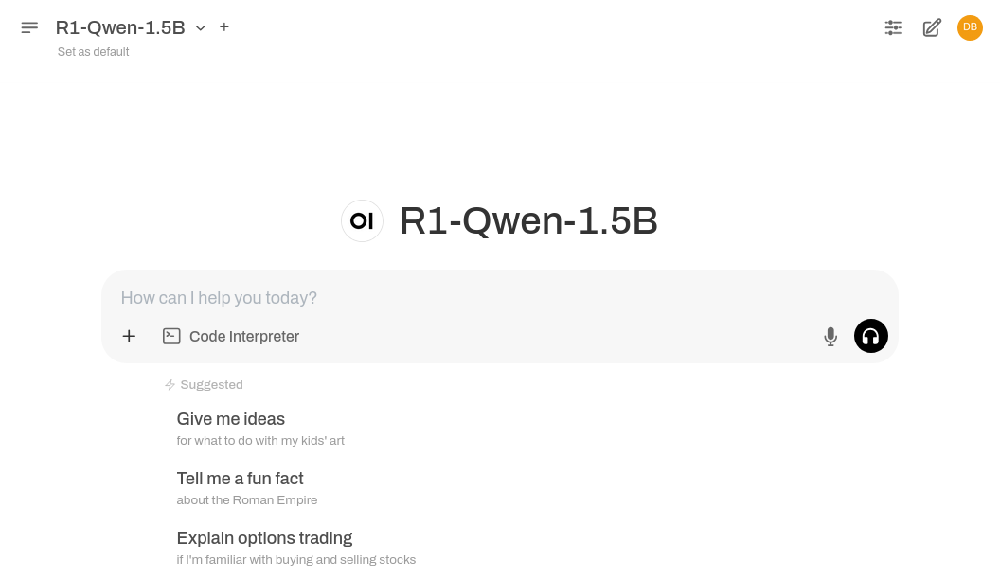

# DeepSeek R1

<iframe
  width="560"
  height="315"
  src="https://www.youtube.com/embed/4c31VE60bII?si=UWZN1sAenS7PSqea"
  title="YouTube video player"
  frameborder="0"
  allow="accelerometer; autoplay; clipboard-write; encrypted-media; gyroscope; picture-in-picture; web-share"
  referrerpolicy="strict-origin-when-cross-origin"
  allowfullscreen>
</iframe>

## Introduction

A high-throughput and memory-efficient inference engine for running DeepSeek R1-Qwen-1.5B model using vLLM. This template provides an OpenAI-compatible API server for the R1-Qwen-1.5B model, optimized for performance using vLLM. This model is based on Qwen2.5-Math-1.5B and fine-tuned with DeepSeek-R1 samples, offering efficient performance for lightweight deployments.

The advantage of using Nosana with DeepSeek R1 is that it simplifies the deployment process, allowing you to focus on model development and optimization.

## Quick Start

Can't wait to get started? Here's a quick guide to deploying the DeepSeek R1 model using the Nosana CLI.

### Using the Nosana Dashboard

For complete beginners, the easiest way to deploy the DeepSeek R1 model is through the Nosana Dashboard. The Dashboard provides a user-friendly interface that will guide you through the deployment process step by step.

**Deploy this model now with [Nosana Dashboard](https://dashboard.nosana.com/jobs/create?templateId=deepseek-r1-qwen-1.5b)**

### Using Nosana CLI

Assuming you have the [Nosana CLI](https://github.com/nosana-ci/nosana-cli) installed and you have topped up your wallet with [SOL](https://solana.com/) and [NOS](https://nosana.com/token).

To get your wallet address, and top up your wallet:

```bash
npx @nosana/cli address
```

Deploy the DeepSeek R1 model using the following command:

```bash
npx @nosana/cli job post \
  --url https://github.com/nosana-ci/pipeline-templates/raw/refs/heads/main/templates/Deepseek-R1-Qwen-7B/job-definition.json \
  --market nvidia-4090 \
  --timeout 60 \
  --wait \
  --verbose
```

This will deploy the DeepSeek R1 model on the Nosana network using the specified job definition file. You will see some output indicating the status of the deployment process, and once the job is successfully deployed, you can start using the model right away.

The model will be available for use at the Service URL provided in the output.
Which has the following format:

```text
Service will be exposed at https://<nosana-job-id>.node.k8s.prd.nos.ci
```

### Interacting with the Model

Now you can interact with the deployed model using the provided Service URL. Use curl, Postman, or any other HTTP client to send requests to the model and receive responses.

::: info
Please note that the following examples need to be adjusted to match the actual job ID. Remember to change the `<nosana-job-id>` with the actual job ID.
:::

#### curl

::: details curl
Using curl, we can easily get a response back. Copy and paste this in your terminal.

```bash
curl https://<nosana-job-id>.node.k8s.prd.nos.ci/v1/chat/completions \
  -H "Content-Type: application/json" \
  -d '{
     "model": "R1-Qwen-1.5B",
     "messages": [{"role": "user", "content": "Tell me something about Nosana."}],
     "temperature": 0.7
   }'
```

:::

#### [OpenAI Python Client](https://github.com/openai/openai-python)

::: details
You can use the OpenAI Python Client to connect to the endpoint and get started building.

First install the OpenAI Python Client.

```bash
pip install openai
```

Then you can use the following Python code to interact with the model.

@[code python](./openai.py)
:::

#### [OpenAI Node.JS Client](https://github.com/openai/openai-node)

::: details
You can also use the OpenAI Node.js Client to connect to the endpoint and get started building.

First install the OpenAI Node.js Client.

```bash
npm i -g openai
```

Then you can use the following TypeScript code to interact with the model.

@[code ts](./openai.ts)
:::

#### [Open WebUI](https://github.com/open-webui/open-webui)

::: details
Using the Open WebUI, you can interact with the model using a user-friendly interface.
Remember to change the `<nosana-job-id>` with the actual job ID.



Start the WebUI locally.

```sh
docker run -d \
  -p 8080:8080 \
  -e OPENAI_API_BASE_URL=https://<nosana-job-id>.node.k8s.prd.nos.ci/v1 \
  -v open-webui:/app/backend/data \
  --restart always \
  ghcr.io/open-webui/open-webui:main
```

The service will be available at [http://localhost:8080](http://localhost:8080).

Use the [Starting with Ollama Guide](https://docs.openwebui.com/getting-started/quick-start/starting-with-ollama/) to add your Nosana Service URL DeepSeek endpoint to the Open WebUI.

:::

## Pre-requisites

- [Node.JS](https://nodejs.org/en/download/)
- [`@nosana/cli`](https://github.com/nosana-ci/nosana-cli)
- [Docker](https://docs.docker.com/get-docker/) or [Podman](https://podman.io/getting-started/installation)
- [Postman (Optional)](https://www.postman.com/downloads/)
- [curl (Optional)](https://curl.se/)
- [Python](https://www.python.org/downloads/)

## Setup and Preparation

As mentioned in the prerequisites, you need to have the necessary software installed on your system.

## Nosana Job Specification

This is a standard Nosana Job Specification. With this you can define how a Nosana job will operate.
The most important parameters of the job specification are:

- `image`: The Docker image to use for the job.
- `entrypoint`: The entrypoint for the container, this is the first shell command to run.
- `cmd`: The command to run inside the container, this can be used to specify any parameters such as flags.
- `gpu`: Whether the job requires a GPU.
- `expose`: The port to expose for the service.

@[code json](./deepseek.json)

To read more about the Job Specification, go to [Nosana Job Specification Section](../../inference/job_schema.md).

## Testing Locally

TODO: Is it even possible to start a session with no GPU?
Will need to check with the dev team on this.
This is useful, because at least then, it will allow devs to prototype their models locally before deploying them.
Otherwise, we will need to do some kind of test / dev environment where they can prototype their deployments.

## Containerization

To build your own Docker container, create a `Dockerfile`, which contains instructions on how to the image will be built, and what extra requirements will be needed.

@[code docker](./Dockerfile)

Here we are using the `vllm/vllm-openai` base image. Then we install [Open WebUI](https://github.com/open-webui/open-webui), a user friendly AI interface. Then we download the `DeepSeek-R1-Distill-Qwen-1.5B` model and run it via [vLLM](https://github.com/vllm-project/vllm), a high-throughput and memory-efficient inference and serving engine for LLMs.

### Build the Container

The next step is to build the container, we do this by running:

```bash
docker build -t <hub-user>/<repo-name>:<tag> .
```
Make sure you have a [ Dockerhub account ](https://hub.docker.com/), and use your username in `<hub-user>`. For the `<repo-name>` use anything you'd like. The `<tag>` is optional.

### Publish the Docker container

Next we need to upload the Docker container to the Dockerhub Registry. Do this by running:

```bash
docker push <hub-user>/<repo-name>:<tag>
```

Now you should be able to navigate to [`https://hub.docker.com/r/<hub-user><repo-name>`](https://hub.docker.com).

Now we can move on to deploying our application to Nosana.

## Deployment

<ClientOnly>
  <AsciinemaCast
    src="https://asciinema.org/a/bJMOlPe5F4mFLY0Rl6fiJSOp3.js"
    id="asciicast-bJMOlPe5F4mFLY0Rl6fiJSOp3"
  />
</ClientOnly>

## Managing the Deployment

## Monitoring the Deployment

## Retrieving and Reviewing the Results

## Wrap Up

```

```
